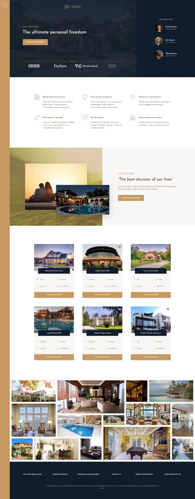

# 🏠 Nexter
### Project built during Jonas Schmedtmann's course  ["Advanced CSS and Sass"](https://www.udemy.com/course/advanced-css-and-sass/)

### 🎓 Student: Tomasz Dańczak
### 🧰 Tools/skills used:
👉 SASS  
👉 BEM Methodology  
👉 7-1 CSS Architecture  
👉 CSS Grid    
👉 Mobile responsive design with Media Queries  

### 🚀 See live demo: [Nexter project](https://tomaszdanczak.github.io/3-Nexter/)

